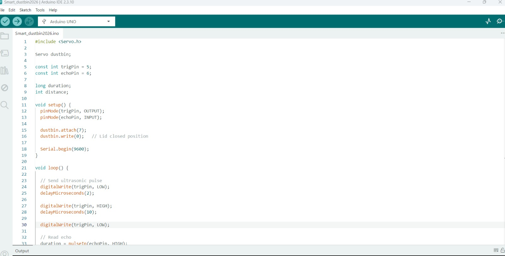
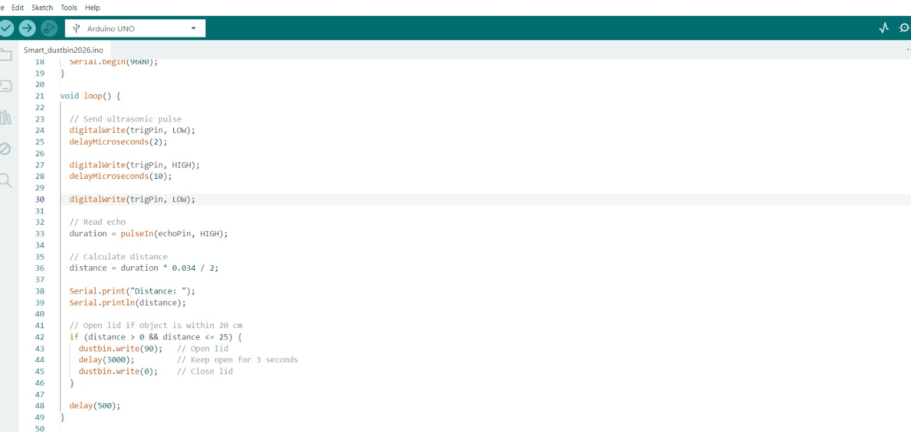
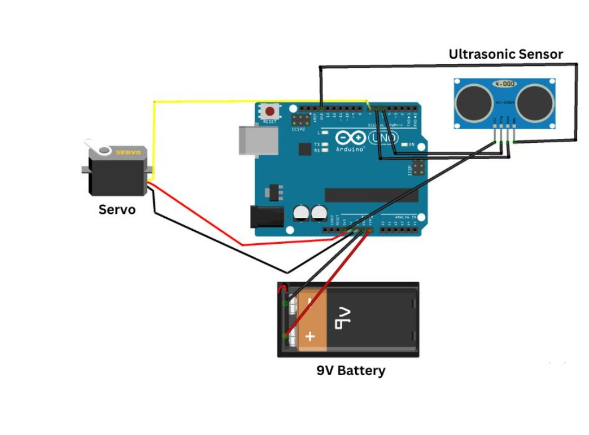

# Smart-Dustbin-Arduino
​This project demonstrates a Smart Dustbin built using an Arduino, an ultrasonic sensor, and a servo motor. When the sensor detects an object at a certain distance, it automatically opens the lid, allowing for touch-free waste disposal.
​Overview
​The goal of this project is to create an automated waste management system that promotes hygiene by eliminating the need to physically touch the bin lid.
​Hardware Components
​Arduino Uno (or compatible board)
​HC-SR04 Ultrasonic Sensor (for proximity detection)
​Servo Motor (for opening/closing the lid)
​Jumper Wires
​Breadboard
​Power Supply (e.g., 9V battery)
​Cardboard/Container (for the physical bin structure)

​How It Works
​The Ultrasonic Sensor continuously emits sound waves to measure the distance of objects in front of the bin.
​The Arduino processes this data. When an object comes within a predefined distance (e.g., 20 cm), it triggers the Servo Motor.
​The Servo Motor rotates to open the bin lid.
​After a short delay, the lid automatically closes to maintain hygiene.

​Circuit Diagram
​HC-SR04 VCC \rightarrow Arduino 5V
​HC-SR04 GND \rightarrow Arduino GND
​HC-SR04 Trig \rightarrow Arduino Digital Pin 9
​HC-SR04 Echo \rightarrow Arduino Digital Pin 10
​Servo Signal \rightarrow Arduino Digital Pin 6
​Servo VCC/GND \rightarrow External Power Supply (ensure common ground with Arduino)

Code Snippet (Arduino IDE)
#include <Servo.h>

Servo dustbin;

const int trigPin = 9;
const int echoPin = 10;

long duration;
int distance;

void setup() {
  pinMode(trigPin, OUTPUT);
  pinMode(echoPin, INPUT);

  dustbin.attach(6);
  dustbin.write(0);   // Lid closed position

  Serial.begin(9600);
}

void loop() {

  // Send ultrasonic pulse
  digitalWrite(trigPin, LOW);
  delayMicroseconds(2);

  digitalWrite(trigPin, HIGH);
  delayMicroseconds(10);

  digitalWrite(trigPin, LOW);

  // Read echo
  duration = pulseIn(echoPin, HIGH);

  // Calculate distance
  distance = duration * 0.034 / 2;

  Serial.print("Distance: ");
  Serial.println(distance);

  // Open lid if object is within 20 cm
  if (distance > 0 && distance <= 20) {
    dustbin.write(90);   // Open lid
    delay(3000);         // Keep open for 3 seconds
    dustbin.write(0);    // Close lid
  }

  delay(500);
}

Setup Instructions
​Assembly: Secure the ultrasonic sensor to the front of the bin. Attach the servo motor to the lid hinge.
​Wiring: Connect components to the Arduino as described in the diagram section.
​Programming: Copy the provided code into the Arduino IDE, select your board, and upload it.
​Testing: Power on the circuit and place your hand near the sensor to observe the lid opening.

 
 
[Watch the Smart Dustbin in Action!](VID_20260623_063017_849_bsl.mp4
)
